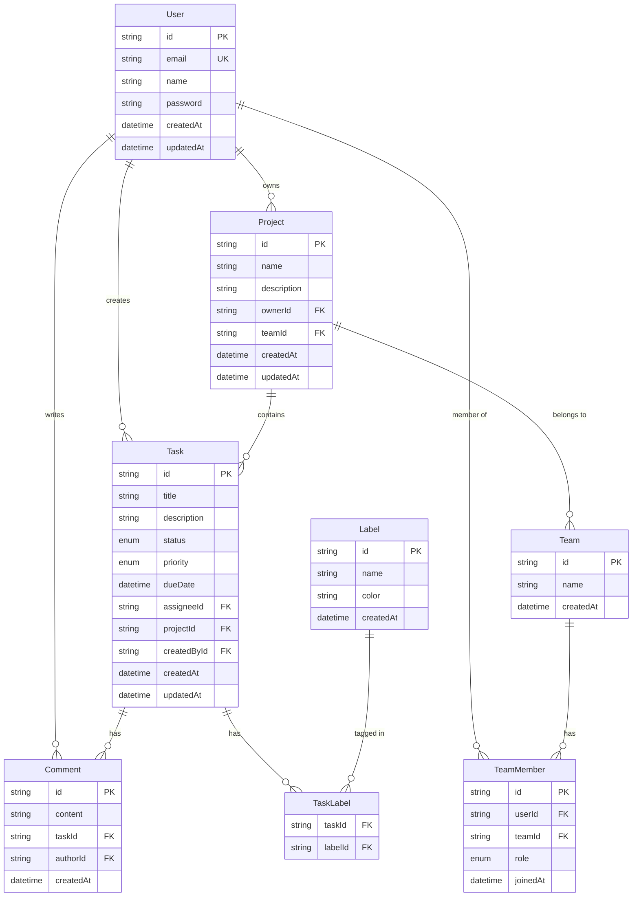

# Backend Implementation Plan: Task Management Application

This plan outlines the setup of a fullstack Next.js application with Prisma ORM, PostgreSQL database, NextAuth.js authentication, and REST API for a task management system.

## User Review Required

> [!IMPORTANT] > **Database Choice**: This plan uses **PostgreSQL** as the database. Please ensure you have PostgreSQL installed locally or have access to a PostgreSQL instance (local, Docker, or cloud service like Supabase/Railway/Neon).
>
> If you don't have PostgreSQL installed, I recommend:
>
> - **Option 1**: Install PostgreSQL locally (via Homebrew on Mac: `brew install postgresql`)
> - **Option 2**: Use Docker: `docker run --name postgres -e POSTGRES_PASSWORD=password -p 5432:5432 -d postgres`
> - **Option 3**: Use a free cloud service like [Supabase](https://supabase.com) or [Neon](https://neon.tech)

> [!WARNING] > **Breaking Changes**: This implementation will modify your existing Next.js application by adding:
>
> - Environment variables (`.env` file)
> - New API routes in `app/api/`
> - Database schema and migrations
> - Authentication configuration

Please confirm you're ready to proceed and which PostgreSQL option you prefer.

---

## Proposed Changes

### Core Dependencies

#### [NEW] Package Dependencies

**New packages to install:**

- `prisma` - Database toolkit and ORM
- `@prisma/client` - Prisma client for database queries
- `next-auth` - Authentication for Next.js
- `bcryptjs` - Password hashing
- `@types/bcryptjs` - TypeScript types for bcryptjs
- `zod` - Already installed, will use for validation

### Database Layer

#### [NEW] [schema.prisma](file:///Users/taufiqulmam/Project/task-management-frontend/prisma/schema.prisma)

**Prisma schema file** defining:

- Database connection (PostgreSQL)
- Data models:
  - **User**: User accounts with authentication
  - **Account**: OAuth accounts (NextAuth)
  - **Session**: User sessions (NextAuth)
  - **VerificationToken**: Email verification tokens (NextAuth)
  - **Project**: Projects containing tasks
  - **Task**: Individual tasks
  - **Team**: Teams for collaboration
  - **TeamMember**: Join table for team members
  - **Comment**: Task comments
  - **Label**: Task labels/tags
  - **TaskLabel**: Join table for task labels

**Schema Features:**

- Relations between models
- Indexes for performance
- Enums for task status, priority, and roles
- Timestamps (createdAt, updatedAt)

---

### Configuration Files

#### [NEW] [.env](file:///Users/taufiqulmam/Project/task-management-frontend/.env)

Environment variables for:

- Database connection URL
- NextAuth configuration (secret, URL)
- JWT secret

#### [MODIFY] [.gitignore](file:///Users/taufiqulmam/Project/task-management-frontend/.gitignore)

Add `.env` file to gitignore to prevent committing secrets.

---

### Authentication Layer

#### [NEW] [app/api/auth/[...nextauth]/route.ts](file:///Users/taufiqulmam/Project/task-management-frontend/app/api/auth/[...nextauth]/route.ts)

**NextAuth configuration** including:

- Prisma adapter for database sessions
- Credentials provider for email/password login
- JWT strategy
- Session callbacks
- Sign-in callbacks with password verification

#### [NEW] [lib/auth.ts](file:///Users/taufiqulmam/Project/task-management-frontend/lib/auth.ts)

**Authentication utilities**:

- Auth options configuration (reusable)
- Helper functions for getting session
- Password hashing utilities

#### [NEW] [lib/prisma.ts](file:///Users/taufiqulmam/Project/task-management-frontend/lib/prisma.ts)

**Prisma client singleton** to prevent multiple instances in development.

---

### API Routes (REST)

#### [NEW] [app/api/auth/register/route.ts](file:///Users/taufiqulmam/Project/task-management-frontend/app/api/auth/register/route.ts)

**User registration endpoint**:

- `POST /api/auth/register`
- Validates input (email, password, name)
- Hashes password
- Creates user in database
- Returns user data (without password)

---

#### [NEW] [app/api/tasks/route.ts](file:///Users/taufiqulmam/Project/task-management-frontend/app/api/tasks/route.ts)

**Task CRUD endpoints**:

- `GET /api/tasks` - List all tasks (with filters)
- `POST /api/tasks` - Create new task

#### [NEW] [app/api/tasks/[id]/route.ts](file:///Users/taufiqulmam/Project/task-management-frontend/app/api/tasks/[id]/route.ts)

**Individual task endpoints**:

- `GET /api/tasks/:id` - Get task detail
- `PUT /api/tasks/:id` - Update task
- `DELETE /api/tasks/:id` - Delete task

---

#### [NEW] [app/api/projects/route.ts](file:///Users/taufiqulmam/Project/task-management-frontend/app/api/projects/route.ts)

**Project CRUD endpoints**:

- `GET /api/projects` - List all projects
- `POST /api/projects` - Create new project

#### [NEW] [app/api/projects/[id]/route.ts](file:///Users/taufiqulmam/Project/task-management-frontend/app/api/projects/[id]/route.ts)

**Individual project endpoints**:

- `GET /api/projects/:id` - Get project detail
- `PUT /api/projects/:id` - Update project
- `DELETE /api/projects/:id` - Delete project

---

#### [NEW] [app/api/users/me/route.ts](file:///Users/taufiqulmam/Project/task-management-frontend/app/api/users/me/route.ts)

**Current user endpoint**:

- `GET /api/users/me` - Get current authenticated user

---

### Middleware & Utilities

#### [NEW] [lib/api-middleware.ts](file:///Users/taufiqulmam/Project/task-management-frontend/lib/api-middleware.ts)

**API utilities**:

- Authentication middleware
- Error handling helpers
- Response formatters

#### [NEW] [types/api.ts](file:///Users/taufiqulmam/Project/task-management-frontend/types/api.ts)

**TypeScript types** for API:

- Request/Response types
- Error types
- API response wrappers

---

## Database Schema Design



---

## API Endpoints Structure

### Authentication

```
POST   /api/auth/register          # Register new user
POST   /api/auth/signin            # Login (handled by NextAuth)
POST   /api/auth/signout           # Logout (handled by NextAuth)
GET    /api/auth/session           # Get current session
```

### Users

```
GET    /api/users/me               # Get current user profile
PUT    /api/users/me               # Update current user profile
```

### Projects

```
GET    /api/projects               # List all projects
POST   /api/projects               # Create new project
GET    /api/projects/:id           # Get project detail
PUT    /api/projects/:id           # Update project
DELETE /api/projects/:id           # Delete project
GET    /api/projects/:id/tasks     # Get all tasks in project
```

### Tasks

```
GET    /api/tasks                  # List all tasks (with filters)
POST   /api/tasks                  # Create new task
GET    /api/tasks/:id              # Get task detail
PUT    /api/tasks/:id              # Update task
DELETE /api/tasks/:id              # Delete task
POST   /api/tasks/:id/comments     # Add comment to task
GET    /api/tasks/:id/comments     # Get task comments
```

### Teams

```
GET    /api/teams                  # List all teams
POST   /api/teams                  # Create new team
GET    /api/teams/:id              # Get team detail
PUT    /api/teams/:id              # Update team
DELETE /api/teams/:id              # Delete team
POST   /api/teams/:id/members      # Add team member
DELETE /api/teams/:id/members/:userId  # Remove team member
```

### Labels

```
GET    /api/labels                 # List all labels
POST   /api/labels                 # Create new label
PUT    /api/labels/:id             # Update label
DELETE /api/labels/:id             # Delete label
```

---

## Verification Plan

### Automated Tests

1. **Database Connection Test**

   ```bash
   npx prisma db push
   npx prisma studio
   ```

2. **API Endpoint Testing**

   - Use Thunder Client / Postman / cURL to test each endpoint
   - Test authentication flow:
     1. Register new user → `POST /api/auth/register`
     2. Sign in → `POST /api/auth/signin`
     3. Get session → `GET /api/auth/session`
   - Test CRUD operations:
     1. Create project → `POST /api/projects`
     2. Create task → `POST /api/tasks`
     3. Update task → `PUT /api/tasks/:id`
     4. Delete task → `DELETE /api/tasks/:id`

3. **Authentication Testing**
   - Test protected routes without authentication (should return 401)
   - Test with valid JWT token (should succeed)
   - Test token expiration

### Manual Verification

1. **Database Inspection**

   - Open Prisma Studio and verify data structure
   - Check relationships between tables
   - Verify indexes are created

2. **API Documentation**

   - Create a simple API testing page/collection
   - Document request/response examples

3. **Frontend Integration Test**
   - Create a simple login page to test NextAuth
   - Create a simple task list to test API integration

---

## Implementation Steps

1. ✅ **Install Dependencies**
2. ✅ **Setup Prisma & Database**
3. ✅ **Create Database Schema**
4. ✅ **Run Database Migration**
5. ✅ **Setup NextAuth Configuration**
6. ✅ **Create Authentication API Routes**
7. ✅ **Create REST API Endpoints**
8. ✅ **Add Middleware & Protection**
9. ✅ **Test & Verify**
10. ✅ **Document API Usage**
